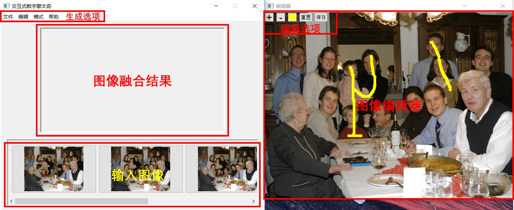

# Interactive Digital Photomontage

## Dependency
  * Qt 5.8.0
  * opencv 3.3.1
  
## Directory Structure
----------
```
  |-README.md   
  |-img                   (result and source images )
    |-bronze
    |-bug
    |-cathedral
    |-family
    |-video
    |-result       (all result imgaes can be checked here)
  |-PhotoMontage_cml_v1   (command mode for backend calling)
  |-PhotoMontage          (qt mode for ui)
```

## Run on Mac osx
----------
Before run this program, you need to modify the 42th line in "mainwindow.h" file in PhotoMontage directory.\
```C
const QString directory =  <the absolute path to "build-PhotoMontage-Desktop_Qt_5_8_0_clang_64bit-Default" dir>
```
Then run the shell cmd as below:

```
 cd PhotoMontage_cml_v1
 cmake .
 make
 cp project_cml ../build-PhotoMontage-Desktop_Qt_5_8_0_clang_64bit-Default/project_cml
 cd ../PhotoMontage
 cmake .
 make
 cp project ../build-PhotoMontage-Desktop_Qt_5_8_0_clang_64bit-Default/project
 cd ../build-PhotoMontage-Desktop_Qt_5_8_0_clang_64bit-Default
 ./project
```

## Keyboard shortcut
  * "v" : Check original picture
  * "d" : Delete all pictures
  * "o" : Import picture
  * "g" : Generate composite picture
  * "0" : USER_SPECIFY 
  * "1" : MAX luminance mode
  * "2" : MIN luminance mode
  * "3" : ERASE mode
  * "4" : MAX LIKELIHOOD mode 
  * "5" : MIN LIKELIHOOD mode
  * "6" : CONTRAST mode
  * "7" : MAX DIFFERENCE mode


## UI instruction
  * UI shows as below:
  
    
  * After run this program,if you want to use the menu on the topbar,you need to first click on the place other than the program window to activate the menu bar.

  * Before you generate the result imgae,you need to choose the mode.The user specified mode and erase mode needs draw labels on every image.Other modes do not require user interaction.


